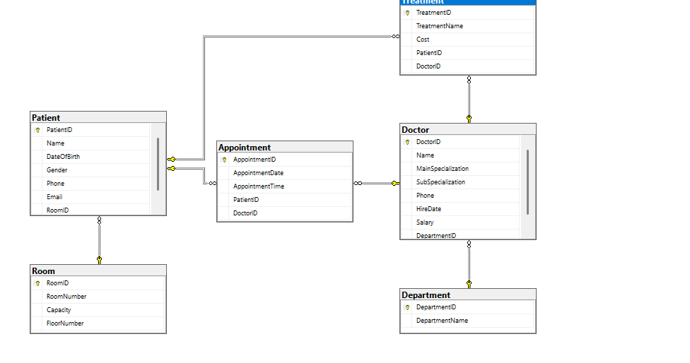
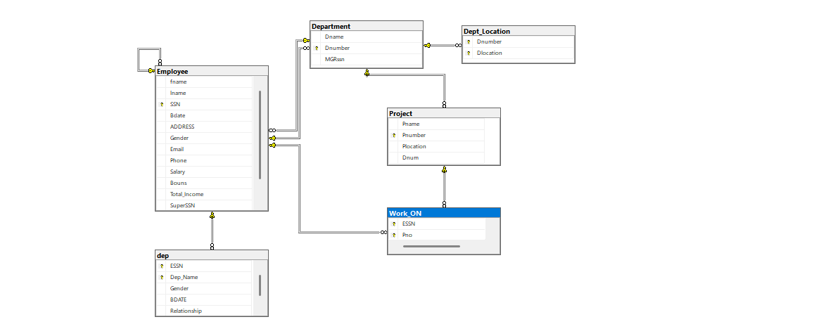
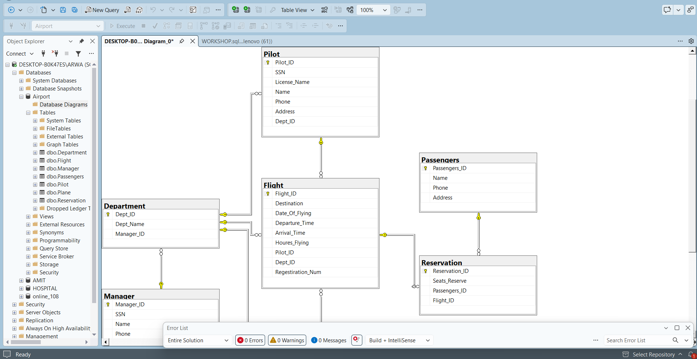

### Hospital Database – DDL & DML

**Task:**  
Design and implement a hospital database to manage patients, doctors, departments, rooms, appointments, and treatments.

The task includes:
- Creating database tables and relationships.
- Defining primary keys, foreign keys, and constraints.
- Inserting sample data using DML.

**Database Diagram:**

**SQL Code:**  
[View SQL File](./HOSPITAL.sql)

### Online 108 Database – SQL Practice

**Task:**
Design and implement the Online 108 database according to the given requirements, including its tables, relationships, keys, constraints, and sample data.

**Database Diagram:**

**SQL Code:**
[View SQL File](./SQL_Online108.sql)

### Workshop – Airport Management System – DDL & DML

**Task:**
Design and implement an Airport Management System database using SQL Server to manage airport operations.

The database includes:

* Departments and managers.
* Planes and their details.
* Pilots and their licenses.
* Flights and flight details.
* Passengers and flight reservations.

The task includes:

* Creating tables and relationships.
* Defining primary keys, foreign keys, and constraints.
* Inserting sample data using DML.
* Drawing the database relationship diagram.

**Database Diagram:**

**SQL Code:**
[View SQL File](./WORKSHOP.sql)

